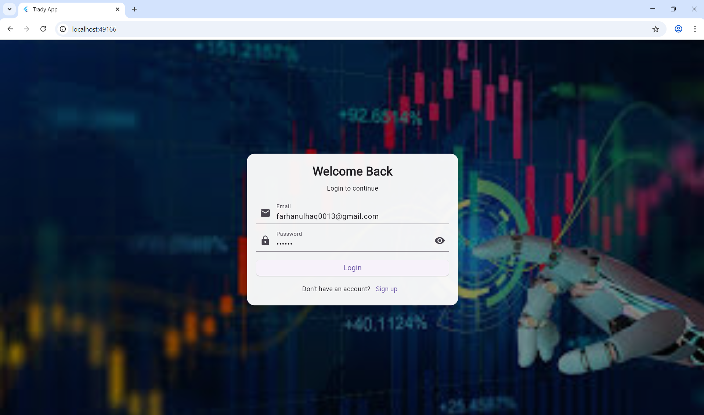
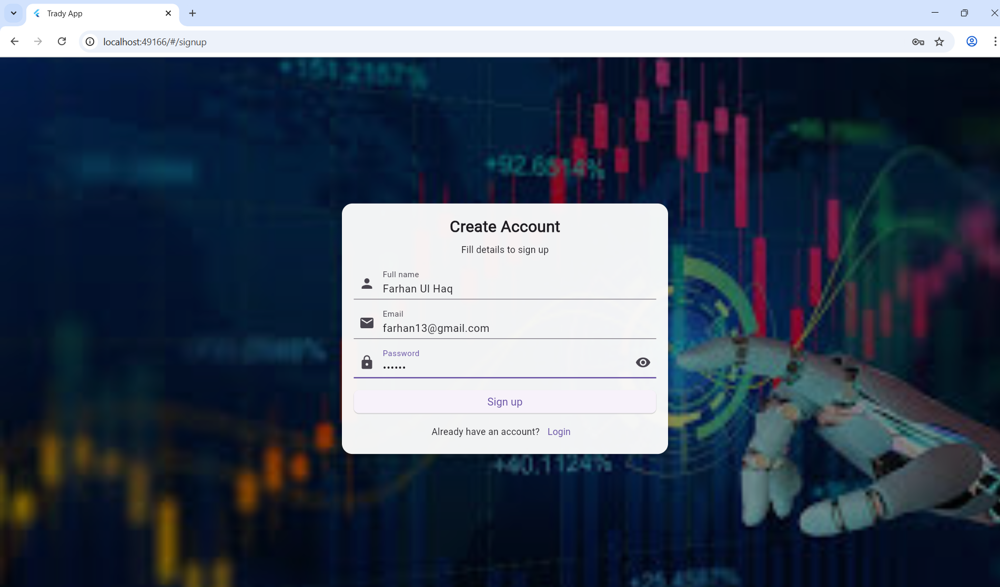
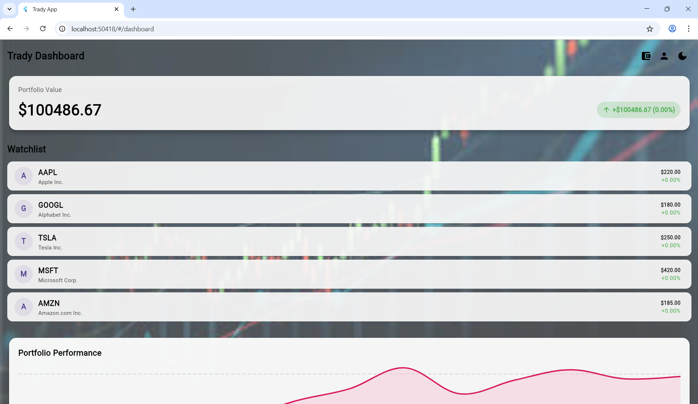
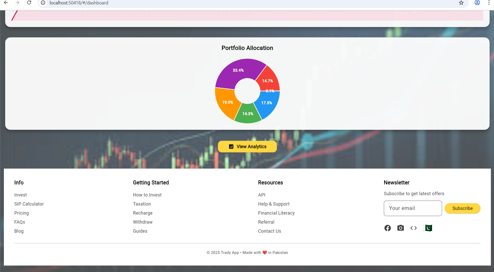
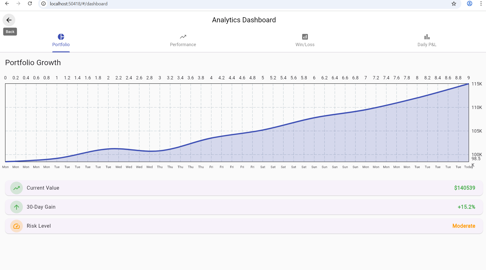

📱 Trading App – Final Module (Module #02 or Final)
📌 A Flutter-Based Paper Trading & Investment Analytics Application

This is the Final Module of the Trading App project built for the Mobile Application Development course. It completes the full prototype of a modern trading dashboard with user authentication, real-time stock monitoring, analytics visualizations, and cloud integration.

🚀 Key Features (Final Module)
🔐 Authentication (Firebase)

Firebase Email/Password Login

Firebase Secure Sign-Up

Password validation

Error handling (invalid email, password too short, etc.)

📊 Real-Time Stock Updates (Alpha Vantage API)

Live stock price updates

Batch API support

Interactive watchlist

Portfolio performance cards

🧠 Analytics Module

Line chart of portfolio trends

Daily performance bar chart

Pie chart of asset allocation

Interactive analytics screen

🧭 Navigation & UI/UX

Dashboard with modern card UI

Dark & Light theme toggle

Footer that appears when scrolled to bottom

Profile screen with dynamic user data

Wallet screen placeholders

Background images with dark overlays

☁️ Cloud & APIs

Firebase Authentication

Alpha Vantage Stock Market API

📂 Final Project Folder Structure
lib/
├── main.dart
├── Login.dart
├── Signup_screen.dart
├── profile_screen.dart
├── wallet_screen.dart
├── dashboard_screen.dart
├── analytics_screen.dart

├── images/
│    ├── 1.jpg
│    ├── 2.jpg
│    ├── portfolio.jpg
│    └── trading.png

├── models/
│    └── stock.dart

├── services/
│    └── stock_service.dart(intitialize key here and also dont commit this to git same as me )

├── api_key/
│    └── api.dart   ← (API KEY stored here you have to generate and use your own folder like this and add api key)
└    | (Remember don't push in git this key )
└── widgets/
├── portfolio_widget.dart
├── performance_widget.dart
├── daily_pi_widget.dart
├── win_loss_widget.dart
└── footer.dart

🔑 APIs & Keys Setup
1️⃣ Firebase Setup

Create a Firebase project

Add Android App (package name your_app_name)

Download google-services.json → place inside:

android/app/

Enable Email/Password Authentication

Add Firebase dependency in pubspec.yaml:

firebase_core: ^3.0.0
firebase_auth: ^5.0.0

2️⃣ Alpha Vantage API Setup

Create a file:

lib/api_key/api.dart

Paste:

class ApiKey {
static const String alphaKey = "YOUR_API_KEY";
}

Used in:

services/stock_service.dart

🛠️ How to Run the Project
1. Clone Repository
   git clone https://github.com/Farhanulhaq19/Trading-App-Final.git

2. Open in VS Code or Android Studio
   cd Trading-App-Final

3. Get Dependencies
   flutter pub get

4. Run on Emulator or Real Device
   flutter run

📸 Screenshots

## 📸 App Screenshots

### 🔐 Login Screen

---

### 📝 Signup Screen

---

### 📊 Dashboard

---

### 📊 Dashboard #02 (Second Photo)

---

### 📈 Analytics Screen

---

### 💼 Wallets Screen

🧩 Final Module Enhancements (Compared to Module #01)
Module #01	Final Module (Module #02)
Basic UI pages	Fully functional app
No backend	Firebase Authentication added
Static dashboard	Real-time stock updates
No analytics	Full charts & portfolio analysis
Basic folder layout	Professional multi-module architecture
No API	Alpha Vantage API integration
No footer	Modern scroll-based footer
🧪 Testing & Validation

Tested on Android Studio Emulator

Verified API responses with network logs

Validated Firebase Auth flows

Dark/light theme tested on multiple screen sizes

👨‍💻 Developed By

Farhan Ul Haq (BSSE – Section 5-1)

Flutter Developer & Project Lead

📘 Course

Mobile Application Development

👨‍🏫 Instructor

Sir Usman

Uiversity

Riphah International University, I-14 ,Islamabad ,Pakistan
📅 Submission

December 2025

🏁 Conclusion

This final Flutter project demonstrates:

✔ Modern UI/UX
✔ Real-time API integration
✔ Cloud authentication
✔ Clean, scalable architecture
✔ Professional repo-level documentation